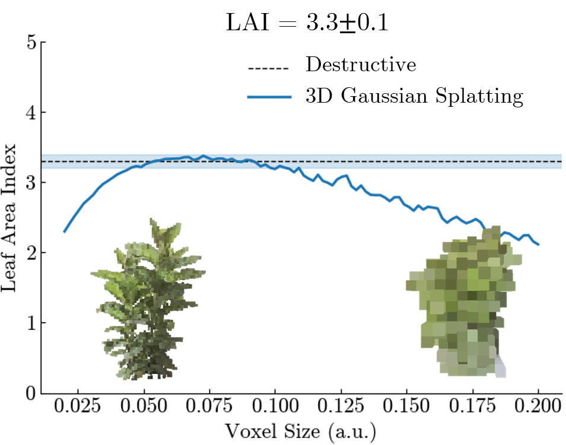

# Leaf Area Index Estimation using 3D Gaussian Splatting

> Westra, J., Boesten, D., Nieboer, S., Aerts, S., & Bolte, J. (2024, May). A novel 3D Gaussian splatting approach for leaf area index estimation of tomato plants. In EHC2024: International Symposium on Robotics, Mechanization and Smart Horticulture 1433 (pp. 291-298).
> [10.17660/ActaHortic.2025.1433.37](https://http://doi.org/10.17660/ActaHortic.2025.1433.37)

This work was part of my job as Junior Researcher at The Hague University of Applied Sciences.

The Leaf Area Index (LAI) is a metric used by grop growers in greenhouses to monitor the average number of leaf layers of the plant, which is correlated to their capacity of producing fruits. It's simply defined as:

$$
\text{LAI} = \frac{A_\text{tot,leaf}}{A_\text{proj,leaf}}
$$
where $A_\text{tot,leaf}$ and $A_\text{proj,leaf}$, leaf denote the total (one-sided) leaf area and the projected leaf area on the ground.

As of now growers estimate the LAI by means of counting the number of leaves or physically measuring a sample of leaves; this estimation is invasive and far from robust.

Using 3D Gaussian Splatting, geometrical model of the plant can be made solely from a smartphone video. The following 3D scan is made using a 20 seconds video shot on an iPhone 13.

<iframe 
  width="560" 
  height="315" 
  src="https://www.youtube.com/embed/Mzt_i712S9g" 
  title="YouTube video player" 
  frameborder="0"
  allow="accelerometer; autoplay; clipboard-write; encrypted-media; gyroscope; picture-in-picture"
  allowfullscreen>
</iframe>

We devised a method for calculating the LAI accurately by transforming the 3DGS model into a voxelized representation. That is, by applying the following classification rule: a voxel is considered to be top leaf surface if there is no voxel above it, that's it. By applying this scheme we're able to accurately estimate the LAI of a plant from video.

Clearly, besides this LAI metric you could come up with many more metrics for monitoring the plants in your greenhouse, in fact quite literally you have a geometrical digital twin of the plant. A model like this would be invaluable for optimizing growth strategies by means of AI.

