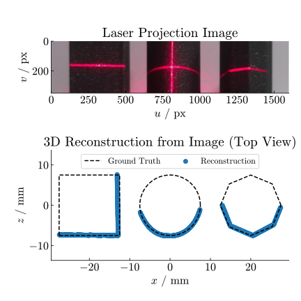

# Laser Caliper
> A laser-module phone case enabling high-accuracy 3D scanning of small objects.

> **NOTE** Paper in progress [[rough draft](https://drive.google.com/file/d/18jcCQrmrs2Y-6Xl1lu-szXL5eEdoH5m0/view?usp=share_link)]

Horticulture workers currently measure plant stems using *digital calipers*, which often damage plants due to the sharp metallic edges of the tool. This motivated the demand from the industry and development of a **non-contact**, **high-accuracy method** for retrieving stem dimensions.

By attaching inexpensive line lasers to a smartphone case and interfacing them via the USB port, we created a low-cost laser scanning module for smartphones (under €20). Using an Android app, structured-light techniques are applied to recover the geometric profile of the stems.

This method can capture *sub-millimeter geometric features*, easily sufficient for stem measurements. Because full profiles are reconstructed, the resulting data are also more accurate and consistent than traditional "1D" caliper readings, which can be biased by the user.

My work mainly focused on:
<ul>
<li>coming up with the conceptual idea and turning it into a working prototype;</li>
<li>handling all mathematical aspects: deriving a simplified calibration method and performing the numerical 3D reconstruction; and</li>
<li>guiding two students: one on hardware development and one on the app implementation.</li>
</ul>

